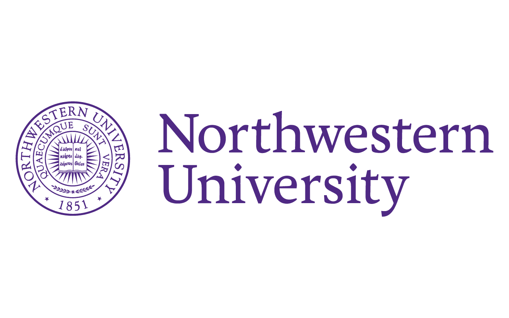
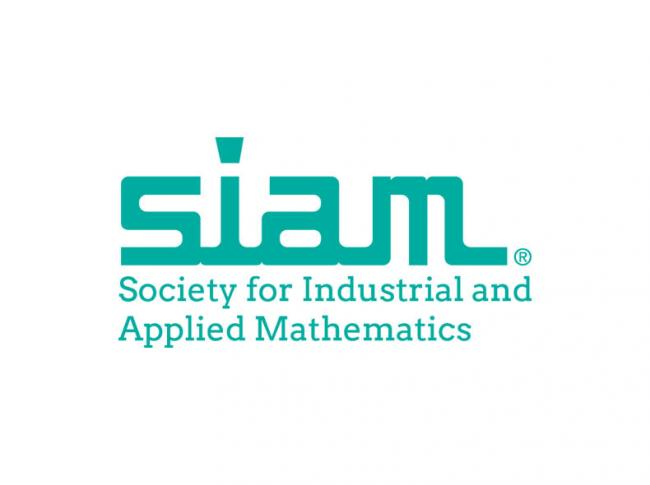

## SIAM Student Chapter at Northwestern University

SIAM Northwestern is a place where Northwestern students can get to know more about what applied math is, and get involved in various events and conferences. We are one of the many student chapters of the [Society for Industrial and Applied Mathematics](https://www.siam.org/), which is the biggest professional society of applied mathematicians.

Our main events through the academic year are the Chicago Area SIAM Student conference and the Bridging the Gap Seminar Series. We also sponsor the student-run Applied Math Journal club in the Engineering Sciences and Applied Mathematics department.

 
