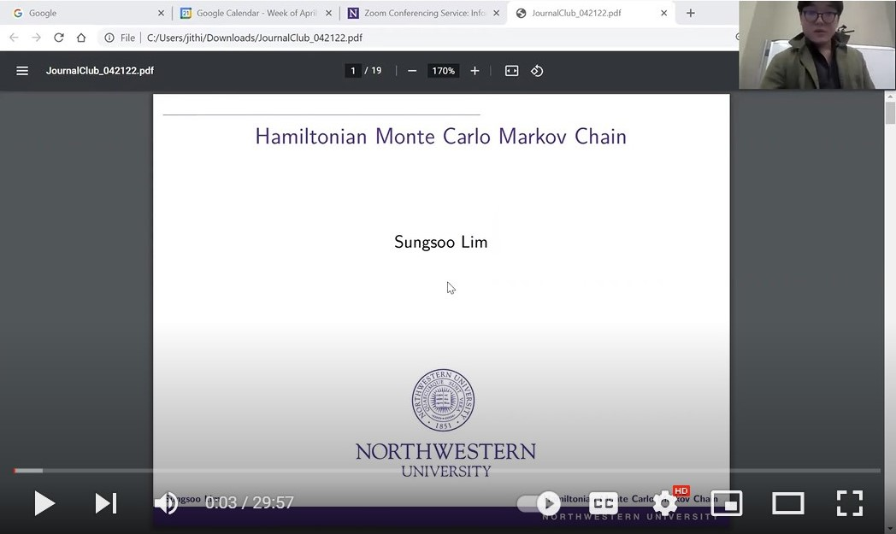
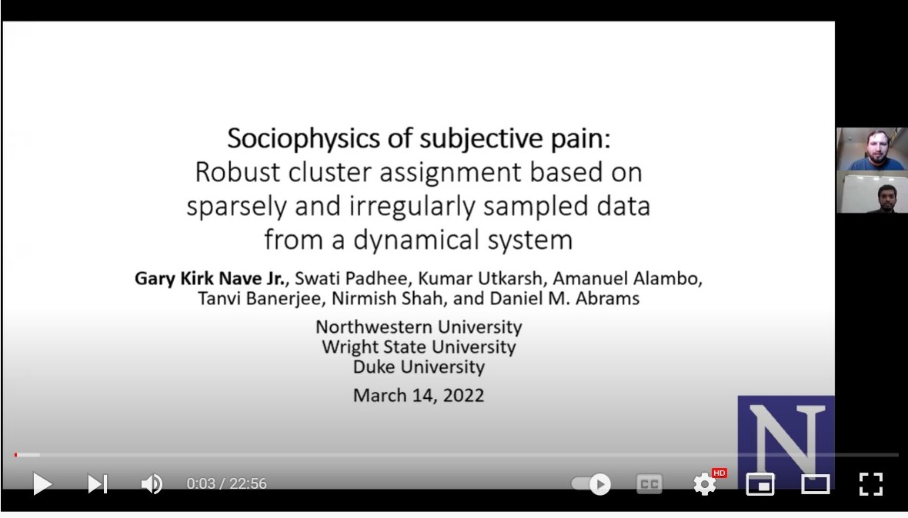

# SIAM Applied Math Journal Club at Northwestern

At ESAM, we have the SIAM applied math journal club which is a student-run seminar
which aims to be a low stakes place where one can discuss and brainstorm their own research, request tutorials on topics and explore new topics with others. These are some of the talks we have had.

## Spring 2022 - Sampling Methods

### Explaining the Gibbs Sampler - Eric Johnson

### MCMC with Hamiltonian dynamics - Sungsoo Lim

### Robust cluster assignment for pain data- Gary Nave

## Fall 2021

### Multiverse Analyis in R - Abhraneel Sarma (Northwestern CS)

### Introduction to Julia - Thomas Stiadle (Northwestern ESAM)

